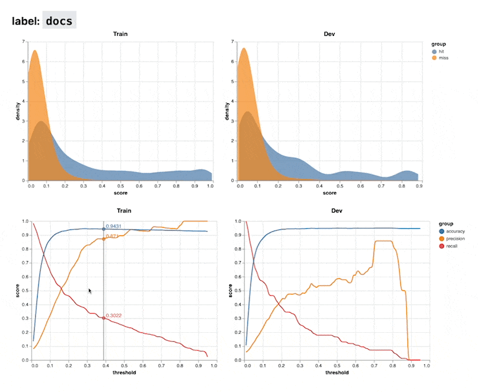

# spacy-report

> The goal of this project is to generate reports for [spaCy](https://spacy.io/) models.

## what it does

The goal of `spacy-report` is to offer static reports for spaCy models that
help users make better decisions on how the models can be used. At the 
moment the project supports interactive views for threshold values for classification. 

Here's a preview of what to expect:



There are two kinds of charts.

1. The first kind is a density chart. This chart shows the distribution
of confidence scores for a given class. The blue area represents documents
that had the tag assigned to the class. The orange area represents documents
that didn't.
2. The second kind is a line chart that demonstrates the accuracy, precision
and recall values for a given confidence threshold. It's an interactive chart
and you can explore the values by hovering over the chart.

## install 

You can install `spacy-report` via pip.

```
python -m pip install spacy-report
```

Alternatively, you can install the latest version from git too. 

```
python -m pip install "spacy-report @ git+https://github.com/koaning/spacy-report.git"
```

## usage

The `spacy-report` project provides a command line interface that can
generate reports. The full CLI can also be explored via the `--help` flag. 

```
> python -m spacy report --help
Usage: python -m spacy report [OPTIONS] COMMAND [ARGS]...

  Generate reports for spaCy models.

Options:
  --help  Show this message and exit.

Commands:
  textcat  Generate a report for textcat models.
  version  Print the version of spacy_report.
```

### `textcat report`

To generate reports for textcat models, you can use the `textcat` sub-command.

```
> python -m spacy report textcat training/model-best/ corpus/train.spacy corpus/dev.spacy

Loading model at training/model-best
Running model on training data...
Running model on development data...
Generating Charts ━━━━━━━━━━━━━━━━━━━━━━━━━━━━━━━━━━━━━━━━ 100% 0:00:00
Done! You can view the report via;

python -m http.server --directory reports PORT 
```

This will generate a folder, "reports" by default, that contains a full 
dashboard for the trained spaCy model found in `training/model-best`. 

The CLI has a few configurable settings:

```text
Arguments:
  [MODEL_PATH]  Path to spaCy model
  [TRAIN_PATH]  Path to training data
  [DEV_PATH]    Path to development data
  [FOLDER_OUT]  Output folder for reports  [default: reports]

Options:
  --classes TEXT  Comma-separated string of classes to use
  --help          Show this message and exit.
```
